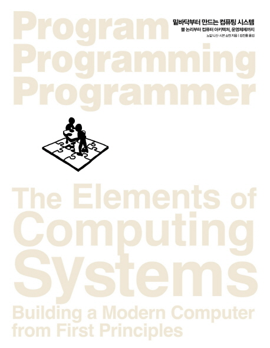

# 밑바닥부터 만드는 컴퓨팅 시스템

[밑바닥부터 만드는 컴퓨팅 시스템(The Elements of Computing Systems)](https://book.naver.com/bookdb/book_detail.nhn?bid=14649857)
읽어가며 정리하는 스터디.

| 주차  | 주제     | 링크                   |
| ----- | -------- | ---------------------- |
| 1주차 | 서론정리 | [서론](./docs/서론.md) |
