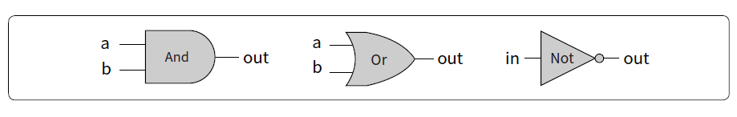

# 1장. 불 논리
- 논리 게이트
- 칩을 어떻게 실제로 구현하는가.
- 하드웨어 설명 및 시뮬레이션 도구

## 1.1 배경
불 게이트.
불 함수를 물리적으로 구현한 것.
불 대수.

### 1.1.1 불 대수
불 대수는 참/거짓, 1/0, 예/아니오, 켜짐/꺼짐과 같은 불(또는 2진수) 값을 가루는 대수학.

불 함수는 2진수를 입력받아 2진수를 출력하는 함수.

#### 진리표 표현

함수의 입력값들과 결과값을 나란히 쓰는 방법

#### 불 표현식

#### 정준 표현

모든 불 함수는 정준 표현이라 불리는 불 표현식으로 표현 가능.

아무리 복잡한 불 함수라도 AND, OR, NOT의 세 가지 불 연산만으로 표혀너 가능하다.

#### 2-입력 불 함수

- Nor: Not-Or의 준말로, x와 y값에 Or를 취한 후 그 결괏값을 반전한 것.
- Xor: 배타적 논리합. 두 변수의 진리값이 서로 반대면 1, 그렇지 않으면 0.
- 등가함수 - 두 변수의 진리값이 같을 때 결괏값이 1인 등가 함수. => if-x-then-y
- Nand: And, Or, Not 연산을 이 함수 하나만으로 만들 수 있다.
  - 모든 불 함수는 Nand연산만으로 표현할 수 있다
  - Nand 기능을 하는 물리적 장치가 여럿 있다면, 어떤 불 함수도 하드웨어로 구현이 가능하다.

### 1.1.2 게이트 논리

게이트는 불 함수를 구현한 물리적 장치다.

```
n개의 변수를 받아 m개의 2진 결괏값을 반환하는 불 함수 f가 있을 때
f를 구현하는 게이트에는 n개의 입력 핀과, m개의 출력 핀이 있다.

이 게이트 입력 핀에 어떤 값 v1, v2, ... vn 을 넣으면 게이트가 출력값 f(v1, v2... vn)을 계산한다.
```

가장 단순한 형태의 게이트들은 트랜지스터를 특정한 구조로 연결해 특정 기능을 하도록 만들 수 있다.

최근에는 대부분의 게이트가 트랜지스터로 구현되며, 게이트는 칩으로 집적된다.

칩과 게이트의 용어가 혼용되지만, 게이트는 보통 단순한 칩을 가리키는데 사용된다.

스위치는 여러 기술로 구현할 수 있지만, 그 기능을 모두 불 대수로 추상화할 수 있다.



#### 기본 게이트와 조합 게이트

모든 논리 게이트는 입력 및 출력 신호 형태가 같으므로, 서로 연달아 잇는다면 더 복잡한 조합 게이트를 만들 수 있다.

어떤 방식으로든 정해진 인터페이스를 따르는 게이트를 구현하자.

효율성 관점에서는 가능한 작은 수의 게이트만 사용하는 최소 비용 최대 효과가 일반적인 요구사항이다.

### 1.1.3. 실제 하드웨어 구성

주어진 칩 설계도가 맞는지 확신하기 위해 복잡한 칩들을 직접 만드는 것은 쉽지 않다.

### 1.1.4. 하드웨어 기술 언어

HDL(하드웨어 기술 언어, Hardware Description Language)

=> 실습은 프로젝트 때 이어서 같이 해보자.

### 1.1.5. 하드웨어 시뮬레이션

## 1.2. 명세

불 연산을 수행하는 게이트들을 정의한다.

### 1.2.1. Nand게이트
| a   | b   | Nand(a, b) |
| --- | --- | ---------- |
| 0   | 0   | 1          |
| 0   | 1   | 1          |
| 1   | 0   | 1          |
| 1   | 1   | 0          |

### 1.2.2. 기본 논리게이트

#### Not
단일 입력 Not 게이트는 컨버터라고도 불린다.
입력값을 0에서 1, 1에서 0으로 변환한다.

#### And
입력값이 둘 다 1일 경우 1을, 그 외에는 0을 반환한다.

#### Or
입력값 중 적어도 하나가 1 일때 1을, 그 외에는 0을 반환한다.

#### Xor
두 입력값이 다를 경우 1, 그 외에는 0을 반환한다.

#### 멀티플렉서
3-입력 게이트로, 선택 비트 입력을 이용해서 나머지 두 개의 데이터 비트 입력 중 하나를 선택한다.
멀티플렉서라는 이름은 통신시스템에서 하나의 출력선에 여러 입력 신호를 직렬화하는데 사용되는 기기 명에서 따온 것이다.

| sel | out |
| --- | --- |
| 0   | a   |
| 1   | b   |

| a   | b   | sel | out |
| --- | --- | --- | --- |
| 0   | 0   | 0   | 0   |
| 0   | 1   | 0   | 0   |
| 1   | 0   | 0   | 1   |
| 1   | 1   | 0   | 1   |
| 0   | 0   | 1   | 0   |
| 0   | 1   | 1   | 1   |
| 1   | 0   | 1   | 0   |
| 1   | 1   | 1   | 1   |

#### 디멀티플렉서
멀티플렉서와 정반대 긴으을 한다.
디멀티플렉서는 선택 비트에 따라 두 출력선 중 하나를 선택해 입력 신호를 내보낸다.

| sel | a   | b   |
| --- | --- | --- |
| 0   | in  | 0   |
| 1   | 0   | in  |